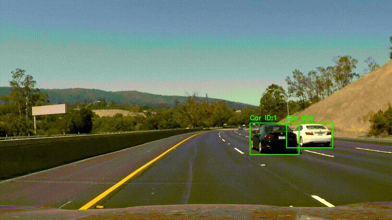

# YOLO26n + Deep SORT Object Tracking

A practical computer vision project implementing **multi-object tracking** by combining YOLO26n object detection with the Deep SORT tracking algorithm on KITTI road-scene video.

## Project Overview

This project extends a YOLO-based 2D object detection pipeline into a **multi-object tracking system**.

The system processes video frame by frame. YOLO26n first detects objects in each frame, and the resulting bounding boxes are passed to **Deep SORT**, which associates detections across consecutive frames and assigns track IDs.

This project demonstrates practical experience with:

* **2D Object Detection**
* **Multi-Object Tracking (MOT)**
* **YOLO26n**
* **Deep SORT**
* **Ultralytics**
* **OpenCV**
* **Video Processing**
* **Bounding Boxes**
* **Track IDs**
* **Detection-to-Tracking Integration**
* **Frame-by-Frame Inference**
* **Computer Vision Visualization**

